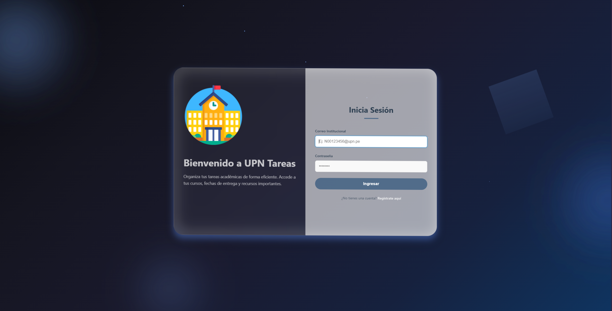
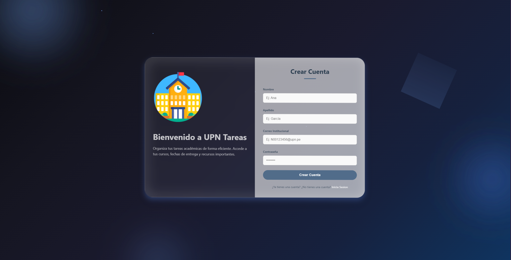
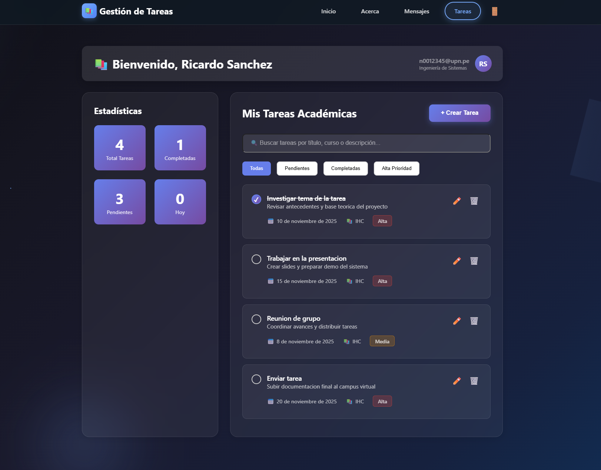
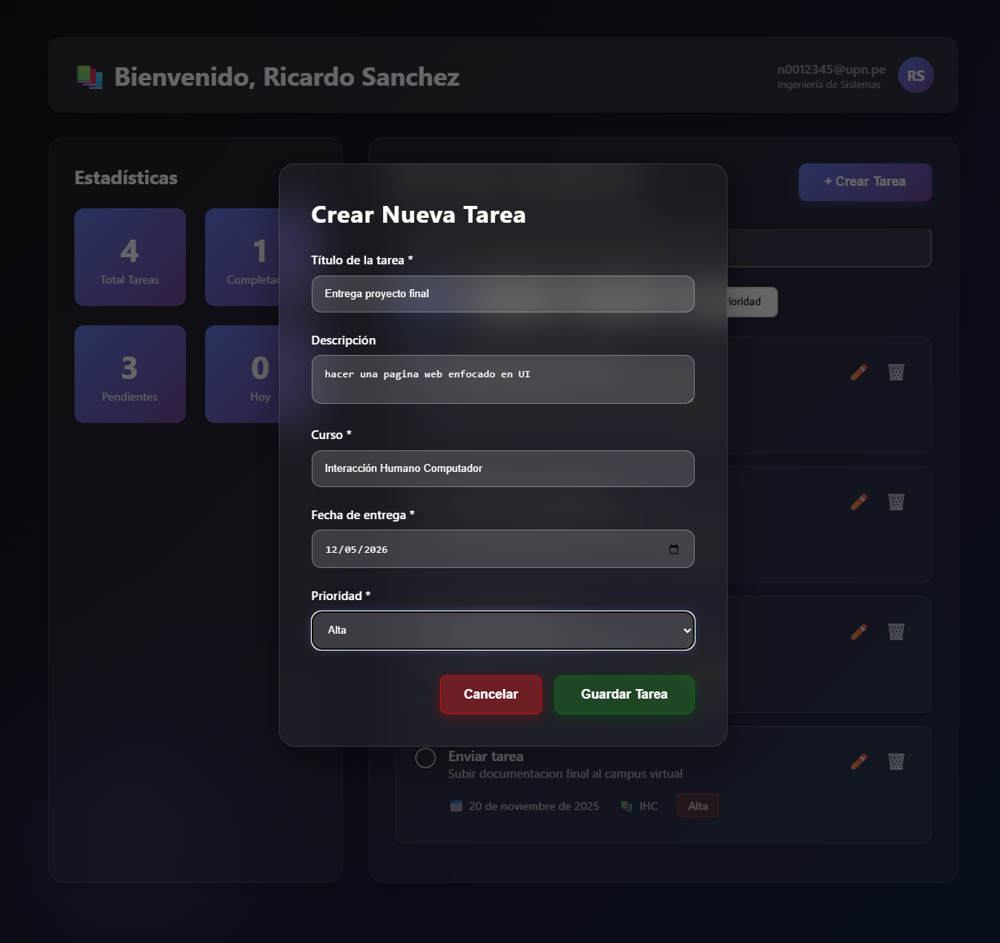
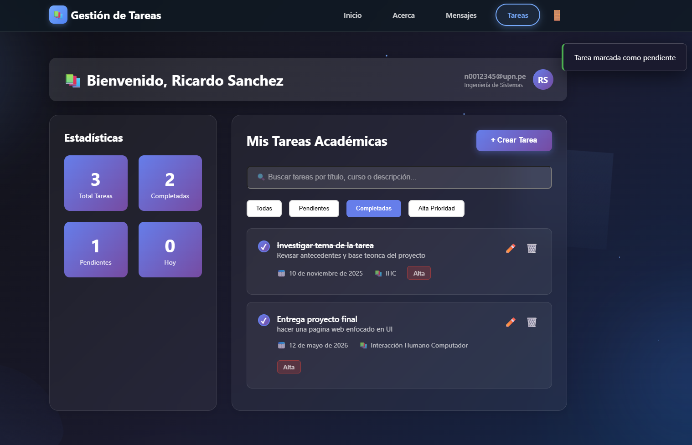
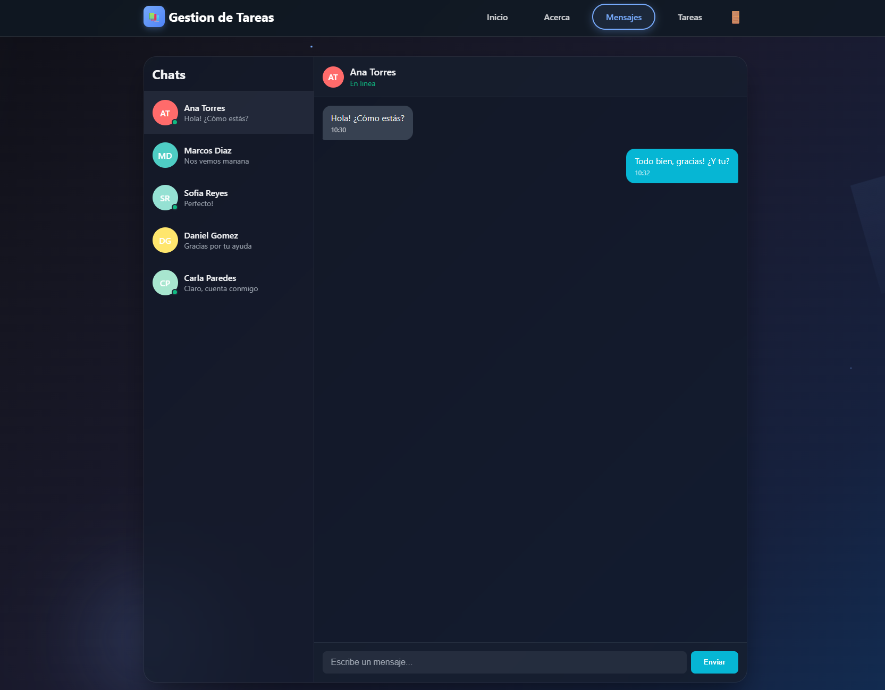
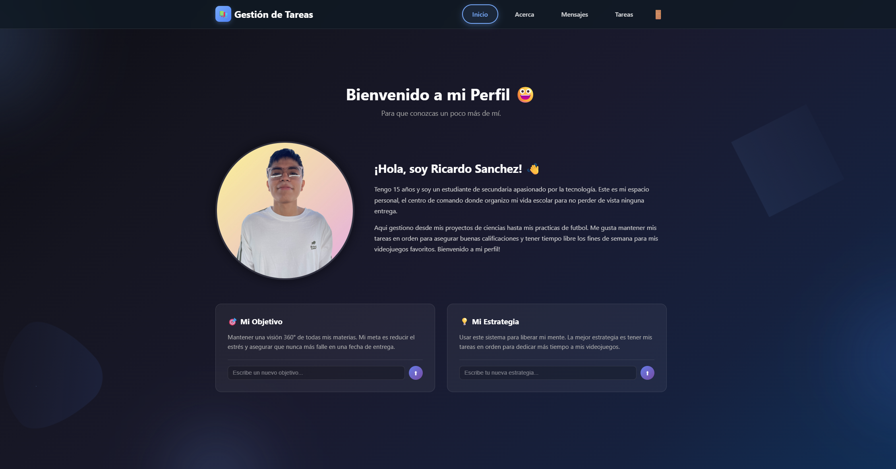

# 🎓 UPN Tareas — Gestión Académica Inteligente

Plataforma web dinámica diseñada para estudiantes de la **UPN**, que permite centralizar tareas, plazos y comunicación en una interfaz moderna y 100% responsiva. 

> **Nota:** Este proyecto es puramente Frontend. Utiliza `localStorage` para la persistencia de datos, eliminando la necesidad de una base de datos externa.

---

## 🚀 Vista Previa del Proyecto

### 🔐 Acceso y Seguridad
Sistema de autenticación dual (Login/Registro) con validación de credenciales institucionales.

| Iniciar Sesión | Crear Cuenta |
| :---: | :---: |
|  |  |

---

### 📋 Gestión de Tareas (Core)
Módulo completo de control académico con estadísticas en tiempo real, filtros de prioridad y buscador dinámico.

| Registro de Tarea | Notificaciones y Filtros |
| :---: | :---: |
|  |  |

---

### 💬 Comunicación y Perfil
Interfaz de chat interactiva para coordinación grupal y panel de bienvenida personalizado.

| Centro de Mensajería | Dashboard de Usuario |
| :---: | :---: |
|  |  |

---

## ✨ Características Destacadas

* **CRUD de Tareas:** Crear, editar, completar y eliminar actividades con fechas límite bloqueadas para el pasado.
* **Filtros Inteligentes:** Clasificación por estado (pendiente/completada) y niveles de prioridad (Alta, Media, Baja).
* **Chat Simulado:** Interfaz de mensajería con estados "en línea" y respuestas automáticas programadas.
* **Estadísticas en Vivo:** Contador automático de tareas pendientes, completadas y vencimientos del día.
* **Diseño Responsive:** Menú hamburguesa y layouts adaptables para dispositivos móviles.

---

## 🛠️ Stack Tecnológico

* **Estructura:** HTML5 Semántico.
* **Estilos:** CSS3 (Animaciones de partículas, Flexbox y Grid).
* **Lógica:** JavaScript ES6+ (Manipulación de DOM, Eventos).
* **Almacenamiento:** API de LocalStorage del navegador.

---

## ⚙️ Cómo Ejecutar

Al ser un proyecto de tecnologías puras (Vanilla), no requiere instalaciones complejas:

1.  **Clona el repositorio:**
    `git clone https://github.com/rlaur205/WEB_Gestion_Tareas.git`
2.  **Abre el archivo principal:**
    Simplemente haz doble clic en `html/index.html` en tu navegador preferido.
3.  **Vía Servidor Local (Opcional):**
    `python -m http.server 8000` y visita `http://localhost:8000/html/index.html`
