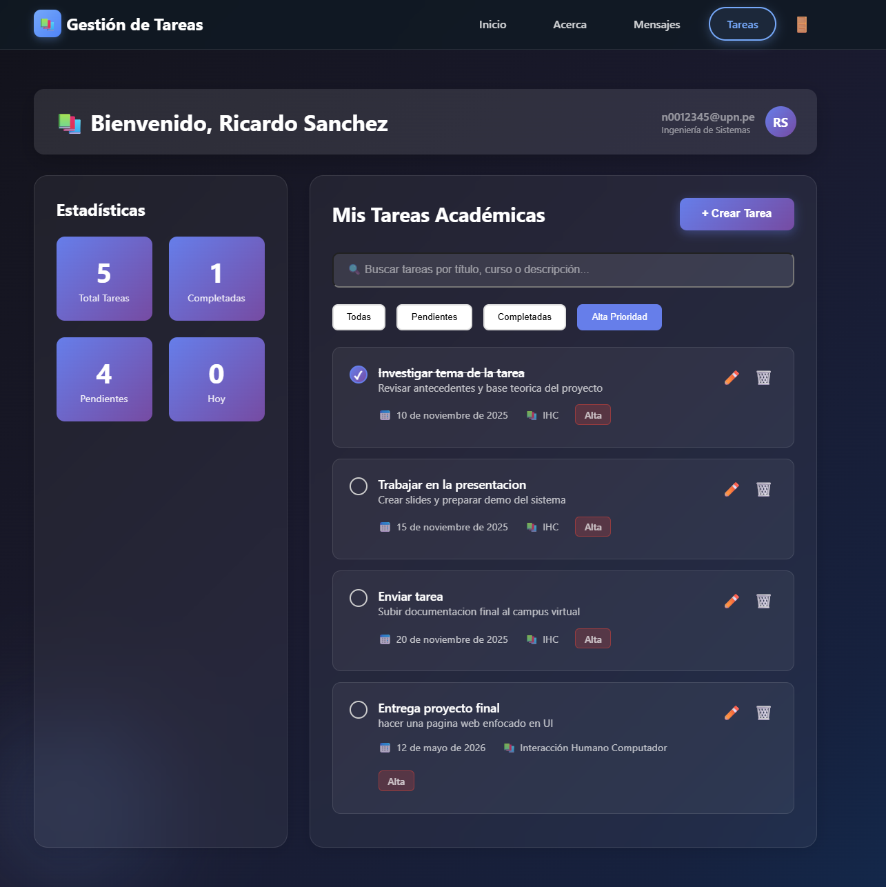
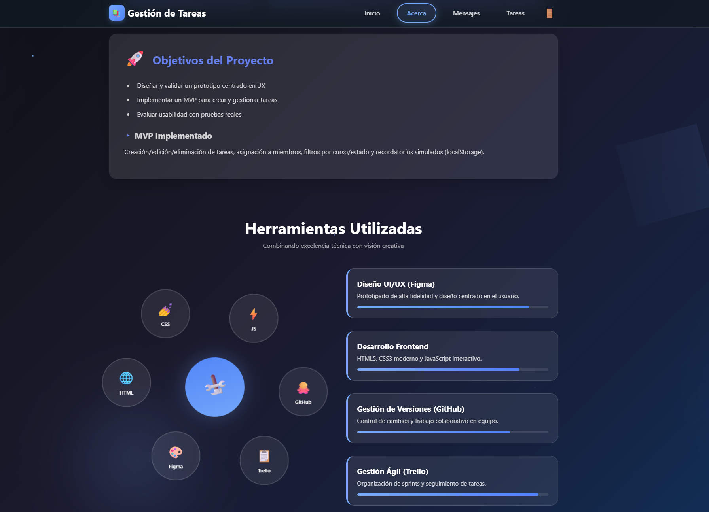
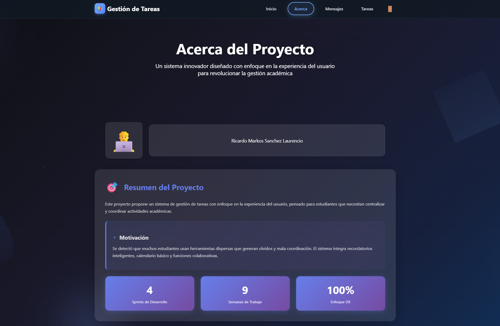

# 🎓 UPN Tareas — Gestión Académica Inteligente

Plataforma web dinámica diseñada para estudiantes de la **UPN**, que permite centralizar tareas, plazos y comunicación en una interfaz moderna y 100% responsiva. 

---

## 🚀 Vista Previa del Proyecto

### 🔐 Acceso y Seguridad
Sistema de autenticación dual con validación de credenciales institucionales.

| Iniciar Sesión | Crear Cuenta |
| :---: | :---: |
|  |  |

---

### 📋 Gestión de Tareas (Core)
Módulo de control académico con estadísticas, filtros y buscador dinámico.

| Registro de Tarea | Notificaciones y Filtros | Tarea Guardada |
| :---: | :---: | :---: |
|  |  |  |

---

### 💬 Comunicación y Perfil
Interfaz de chat interactiva y panel de bienvenida personalizado.

| Centro de Mensajería | Dashboard de Usuario |
| :---: | :---: |
|  |  |

---

### 👨‍💻 Sobre el Proyecto y Equipo
Detalles del desarrollo, objetivos alcanzados y el equipo detrás del MVP.

| Stack Técnico y Metas | Equipo de Desarrollo |
| :---: | :---: |
|  |  |

---

## ✨ Características Destacadas

* **CRUD de Tareas:** Crear, editar y eliminar actividades con persistencia local.
* **Filtros Inteligentes:** Clasificación por estado y niveles de prioridad.
* **Chat Simulado:** Interfaz de mensajería con respuestas automáticas.
* **Estadísticas en Vivo:** Seguimiento de tareas pendientes y vencimientos.
* **Diseño Responsive:** Layouts adaptables para cualquier dispositivo.

---

## ⚙️ Instalación y Ejecución

Al ser un proyecto de tecnologías puras, no requiere instalaciones:

1. **Clona el repositorio:**
   `git clone https://github.com/rlaur205/WEB_Gestion_Tareas.git`

2. **Ejecución:**
   Abre el archivo `html/index.html` en tu navegador.

3. **Servidor Local (Opcional):**
   `python -m http.server 8000` -> Acceder a `http://localhost:8000/html/index.html`
